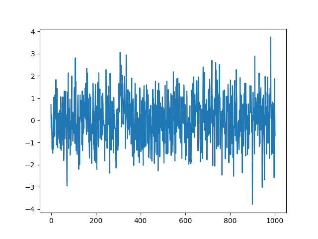

### AR models


AR(1) model:
$$
y_t = a_1 y_{t-1}+\epsilon_t
$$
AR(2) model:
$$
y_t = a_1 y_{t-1}+a_2 y_{t-2}+\epsilon_t
$$
AR(p) model:
$$
y_t = a_1 y_{t-1}+a_2 y_{t-2}+...+a_p y_{t-p}+\epsilon_t
$$


usando la notación del libro, un AR(1) se puede expresar como:
$$
Y_t = \phi Y_{t-1}+e_t
$$
la autocovarianza resulta:
$$
\gamma_0 = \frac{\sigma_e^2}{1-\phi^2}
$$

$$
\gamma_k = \phi^k  \frac{\sigma_e^2}{1-\phi^2}
$$
y el coeficiente de autocorrelación resulta:
$$
\rho_k = \frac{\gamma_k}{\gamma_0}=\phi^k \text{   para }k=1,2,3,... 
$$
Usando notación recursiva, para el caso general se puede expresar:
$$
Y_{t-1} = \phi Y_{t-2}+e_{t-1}
$$
y entonces
$$
Y_t = \phi(\phi Y_{t-2}+e_{t-1})+e_t
$$
asumiendo que $|\phi|<1$ y k es suficientemente grande se puede obtener la representación en serie infinita como
$$
Y_t = e_t + \phi e_{t-1} + \phi^2 e_{t-2}+ \phi^3 e_{t-3}+ ...
$$
esta es la forma de proceso lineal general, de donde los coeficientes se relación con los del proceso generalizado como:
$$
\Psi_j = \phi^j
$$

#### Ejemplo

```python
# AR(2)
N=1000
a1=0.4
a2=0.35
x=np.arange(2)
e_t=np.random.normal(0,1)
y=np.append(x,a1*x[1]+a2*x[0]+e_t)

for i in range(N):
   e_t=np.random.normal(0,1)
   y=np.append(y,a1*y[-1]+a2*y[-2]+e_t)


y.mean()
y.std()
plt.plot(y);plt.show()

```


### MA models


MA(1) model:
$$
y_t = b_1\epsilon_{t-1}+\epsilon_t
$$
MA(2) model:
$$
y_t = b_1\epsilon_{t-1}+b_2\epsilon_{t-2}+\epsilon_t
$$
MA(q) model
$$
y_t = b_1\epsilon_{t-1}+b_2\epsilon_{t-2}+...+b_q\epsilon_{t-q}+\epsilon_t
$$

usando la notación del libro: 
$$
Y_t = e_t - \theta_1e_{t-1} - \theta_2e_{t-2}-...- \theta_qe_{t-q}
$$
resulta que la **autocovarianza** es: 
$$
\gamma_0=(1+\theta_1^2+\theta_2^2+...+\theta_q^2)\sigma_e^2
$$
y la **autocorrelación** es:
$$
\rho_k = 
\begin{cases}
\frac{-\theta_k+\theta_1\theta_{k+1}+\theta_2\theta_{k+2}+...+\theta_q\theta_{k+q}}{1+\theta_1^2+\theta_2^2+...+\theta_q^2}& \text{for }k=1,2,...,q\\
0 & \text{for }k=0
\end{cases}
$$

#### Ejemplo

```python
# MA(1)
N =1000
b1 =0.25
e_t0 = np.random.normal(0,1)
e_t1 = np.random.normal(0,1)
y = np.append(e_t0,b1*e_t0+e_t1)  # y1 = b1*e_t0+e_t1

for i in range(N):
   e_t0 = e_t1
   e_t1 = np.random.normal(0,1)
   y = np.append(y,b1*e_t0+e_t1)


y.mean()
y.std()
plt.plot(y);plt.show()

```




#### ARMA  models

AR+MA (1,1):
$$
y_t = a_1y_{t-1} + b_1\epsilon_{t-1}+\epsilon_t
$$
ARMA(p,q)
$$
y_t = a_1y_{t-1} + ... + a_py_{t-p} + b_1\epsilon_{t-1} +...+b_q\epsilon_{t-q} +\epsilon_t
$$

$$
y_t = \sum_{i=1}^pa_iy_{t-i} + \sum_{j=1}^q b_i\epsilon_{t-i} + \epsilon_t
$$

#### Ejemplo


```python
#ARMA

N=10000
a1=0.4
a2=0.3
b1 =-0.3

x=np.arange(2)
e_t=np.random.normal(0,1)
y=np.append(x,a1*x[1]+a2*x[0]+e_t)

for i in range(N):
   e_0 = e_t
   e_t=np.random.normal(0,1)
   y=np.append(y,a1*y[-1]+a2*y[-2]+ b1*e_0 + e_t)


y.mean()
y.std()
#plt.plot(y);plt.show()

```

