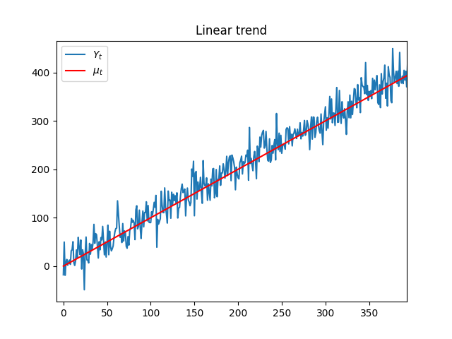
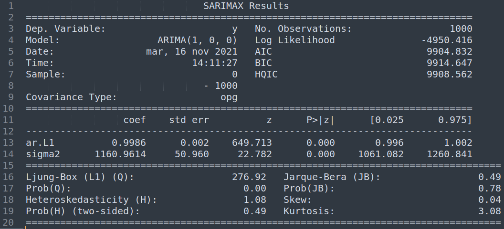
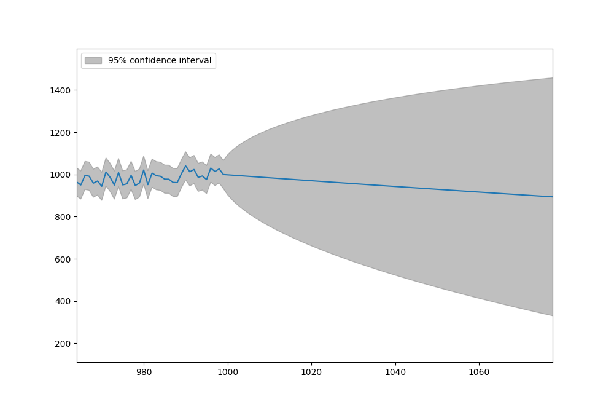
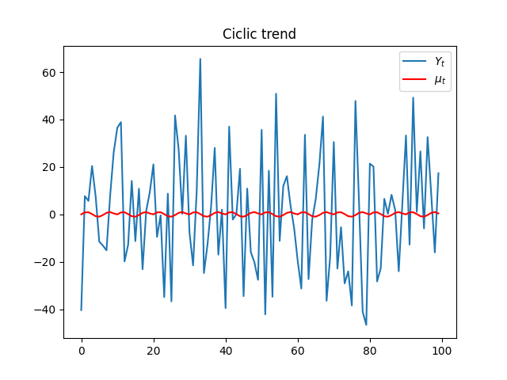
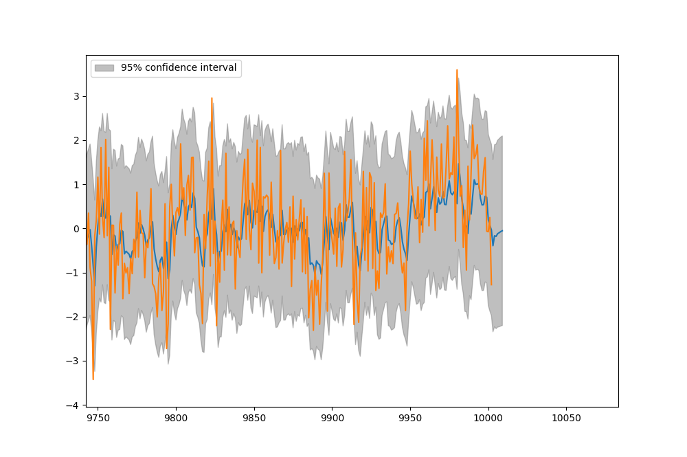

# Predicciones


[TOC]


## Procesos estocásticos con tendencia determinística

Supongamos el proceso Y formado por una componente estocástica X y una tendencia determinística mu, de la forma:
$$
Y_t = X_t + \mu_t
$$
Como hemos visto la tendencia puede tener distintas representaciones:
$$
\text{Tendencia determinística }\mu_t := 
\begin{cases}
\text{ Constante  }&\mu_t=\mu\    \\
\text{ Lineal  }&\mu_t=\beta_0+\beta_1t\    \\
\text{ Cuadrática  }&\mu_t =\beta_0+\beta_1t+\beta_2t^2 \    \\
\text{ Cíclica  }&\mu_t=\mu_{t-T}   \\
\text{ Senoidal  }&\mu_t=\beta\cos(\omega t+\phi)\    \\

\end{cases}
$$

### Tendencia Lineal

```python
N=1000
mu=np.arange(0,N)
X=np.random.normal(5,25,N)
Y=X+mu
plt.plot(Y)
plt.plot(mu,color='red')
plt.title("Linear trend")
plt.legend(['$Y_t$','$\mu_t$'])
plt.show()
```




#### Modelo AR(1)

```python
from statsmodels.graphics.tsaplots import plot_predict
from statsmodels.tsa.arima_process import arma_generate_sample
from statsmodels.tsa.arima.model import ARIMA
from sklearn.metrics import mean_squared_error

ar1 = ARIMA(Y, order=(1, 0, 0), trend="n")
ar1_res = ar1.fit()
print(ar1_res.summary())
```




#### Predicción

```python
fig, ax = plt.subplots(figsize=(10, 8))
fig = plot_predict(ar1_res, start=1,end=2000, ax=ax)
legend = ax.legend(loc="upper left")
plt.show()
```



#### Resultados

Lo que se observa es que  a medida que aumenta el largo de la predicción aumenta también el intervalo de confianza del 95%, haciendo que la predicción acumule error. Esto se puede ver con la forma general del proceso ARIMA. Si $\Psi_1,\Psi_2,...,\Psi_{l-1}$ son los coeficientes del proceso, se puede observar que la varianza de la predicción del proceso AR(1) es:
$$
\textrm{var}(e_t(\ell)) = \sigma_e^2 (1+\Psi_1^2+\Psi_2^2+...+\Psi_{\ell-1}^2)
$$
es decir que la varianza aumenta a medida que se agregan términos de predicción o bien aumenta $\ell$.  Para el caso AR1 además se puede usar el resultado de la serie geométrica y ver que:
$$
\textrm{var}(e_t(\ell)) = \sigma_e^2 \left(\frac{1-\phi^{2\ell}}{1-\phi^2}\right)
$$
cuando el retardo $\ell$ es muy largo, se puede aproximar y ver que el resultado es la autocovarianza de Y.
$$
\textrm{var}(e_t(\ell)) \approx \left(\frac{\sigma_e^2 }{1-\phi^2}\right)\approx\textrm{var}(Y_t)=\gamma_0
$$


### Tendencia cíclica

```python
n=100
N=10000
mu=np.repeat(np.sin(np.arange(n)),int(N/n))
X=np.random.normal(5,25,int(N))
Y=X+mu
plt.plot(Y)
plt.plot(mu,color='red')
plt.title("Ciclic trend")
plt.legend(['$Y_t$','$\mu_t$'])
plt.show()
```



#### Modelo ARMA(2,1)


```python
#ARMA

N=10000
a1=0.4
a2=0.3
b1 =-0.3

x=np.arange(2)
e_t=np.random.normal(0,1)
y=np.append(x,a1*x[1]+a2*x[0]+e_t)

for i in range(N):
   e_0 = e_t
   e_t=np.random.normal(0,1)
   y=np.append(y,a1*y[-1]+a2*y[-2]+ b1*e_0 + e_t)


y.mean()
y.std()
plt.plot(y);plt.show()

```


#### Predicción 

```python
# Predict
y_arma = ARIMA(y, order=(2, 0, 1))
y_arma_res = y_arma.fit()
print(y_arma_res.summary())

fig, ax = plt.subplots(figsize=(10, 8))
fig = plot_predict(y_arma_res, start=1,end=N+10, ax=ax)
plt.plot(y)
legend = ax.legend(loc="upper left")
plt.show()

```


#### Resultados



