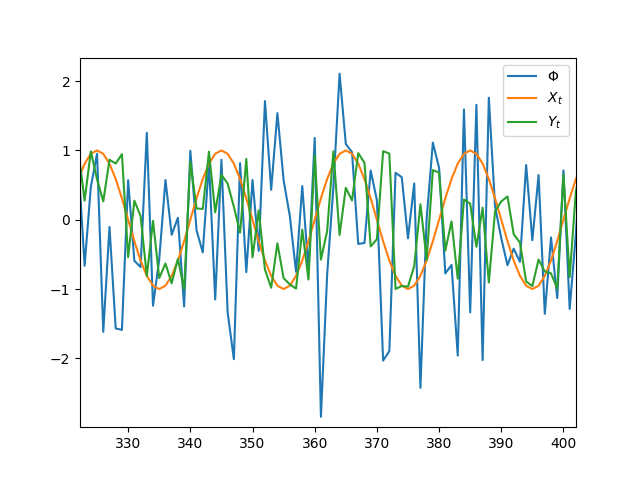
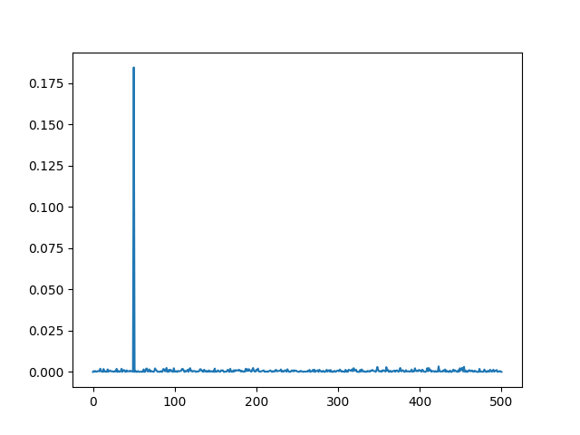
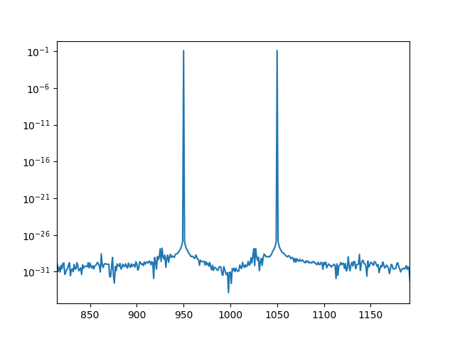

# Introducción al Análisis Espectral


### Análisis en el dominio del tiempo


Consideremos el proceso dado por la expresión:
$$
Y_t = R\cos(2\pi ft+ \Phi)
$$
donde $\Phi$ es una variable aleatoria, R la amplitud, f es la frecuencia y t el tiempo.

* amplitud
* frecuencia
* fase

La expresión anterior puede ser difíil de estimar ya que los parámetros R y $\Phi$ no son lineales. 

Usando trigonometría se puede transformar la expresión en:
$$
Y_t = R\cos(2\pi f t + \Phi) = A\cos(2\pi f t ) + B\sin(2\pi f t)
$$
y entonces los parámetros nuevos resultan de:
$$
\begin{align}
& A = R\cos(\Phi) & &B=-R\sin(\Phi)\\
& R =\sqrt{A^2+B^2}& & \Phi = \arctan(-B/A)
\end{align}
$$
luego se puede ajustar A y B para una frecuencia fija f a partir de los datos usando regresión por cuadrados mínimos.


Una combinación lineal general de senos y cosenos se puede escribir como:
$$
Y_t = A_0 + \sum_{j=1}^m (A_j\cos(2\pi f_j t) + B_j \sin(2\pi f_j t ))
$$
Con cuadrados mínimos ordinarios se puede ajustar los valores de los $A_j$ y $B_j$.

#### Fourier

Suponiendo que n es impar, esto es n=2k+1, se tiene que las frecuencias de la forma 1/n, 2/n, ..., k/n se denominan *frecuencias de Fourier*. Las variables predictoras del seno y coseno a tales frecuencias son ortogonales, y la estimación por cuadrados mínimos resulta simplemente:
$$
\begin{align}
&\hat{A}_0 = \bar{Y}\\
&\hat{A}_j = \frac{2}{n}\sum_{t=1}^n Y_t\cos(2\pi t j/n) && \hat{B}_j =  \frac{2}{n}\sum_{t=1}^nY_t\sin(2\pi t j /n)
\end{align}
$$


El resultado de la serie de suma de cosenos y senos es general. Esto es, cualquier serie de cualquier longitud n, sea determinística o estocástica y con o sin periodicidades verdaderas puede ajustarse poerfectamente por este modelo eligiendo m=n/2 si n es par y m=(n-1)/2 si n es impar. Luego habrá n parámetros a estimar para ajustar la serie de largo n.


#### Periodograma

Para muestras de tamaño impar, el periodogram se define como:
$$
I(j/n) = \frac{n}{2}(\hat{A}_j^2+\hat{B}_j^2)
$$
donde j/n es la frecuencia para j=1, 2, ..., k.

Si la muestra tiene tamaño par y n=2k, en la frecuencia de corte f=k/n=1/2 resulta:
$$
I(1/2) = n\hat{A}_k^2
$$
Como el periodograma es proporcional a la suma de los cuadrados de los coeficientes de regresión asociados con la frecuencia f=j/n, la altura del periodograma muestra la fuerza relativa de los pares seno y coseno en varias frecuencias del comportamiento general de la serie. En términos de estadística podemos usar el análisis de la varianza. El periodograma es la suma de los cuadrados con dos grados de libertad asociados con el par de coeficientes $(A_j,B_j)$  de la frecuencia j/n cuando n es impar: 
$$
\sum_{j=1}^n (Y_j-\hat{Y})^2 = \sum_{j=1}^k I(j/n)
$$
Como conclusión, en cualquiera de los casos se tiene que para series largas habrá que estimar un número grande de parámetros y para esto se usa la transformada rápida de Fourier, o FFT.

#### Ejemplos


```python
import numpy as np
import matplotlib.pyplot as plt
from numpy import pi as pi
from numpy import sin as sin
from numpy import cos as cos
from scipy import signal

# example 1a 
N=1000
f=50
T=1/f
t=np.arange(N)
Phi=np.random.normal(0,1,N)
X=sin(2*pi*f*t/N)
Y=sin(2*pi*f*t/N + Phi)

plt.plot(Phi)
plt.plot(X)
plt.plot(Y)
plt.legend(['$\Phi$','$X_t$','$Y_t$'])
plt.show()
```




En la figura se puede observar la componente $X_t$ que corresponde a una onda senoidal, la componente de ruido blanco $\Phi$ y el proceso $Y_t$ que es una onda senoidal con fase aleatoria. 


Si resolvemos el periodograma, podemos encontrar las frecuencias características del proceso.

```python

#F, Pxx_den = signal.periodogram(X,N)
#plt.semilogy(F, Pxx_den)
G, Pyy_den = signal.periodogram(Y,N)
plt.plot(G, Pyy_den)
#plt.legend(['$F(X)$','$F(Y)$'])
plt.show()

```



Se puede observar el piso de ruido y una componente marcada en la frecuencia 50.

En el repo hay más ejemplos.


Análisis en el dominio de la frecuencia (análisis espectral)

Usando notación de números complejos también se puede expresar la descomposición en serie de Fourier como:
$$
Y_t = \sum_{k=-N}^N c_ke^{j\omega k t }
$$


Ejemplo de señal modulada.



#### Densidad espectral de potencia

Si la autocovarianza decrece rápido a medida que aumentan los retardos y se satisface que tienen energía finita, esto es:
$$
\sum_{k=-\infty}^{\infty}|C_k|<	\infty
$$
se puede definir la transformada de Fourier de la autocovarianza. La función definida entre $-1/2<f<1/2$ como sigue se denomina *densidad espectral de potencia*. 
$$
p(f) = \sum_{k=-\infty}^\infty C_ke^{-2\pi jkf}
$$
Se puede ver que:
$$
\begin{align}
p(f) &= \sum_{k=-\infty}^\infty C_ke^{-2\pi jkf}\\
&=\sum_{k=-\infty}^\infty \cos(2\pi kf) - j\sum_{k=-\infty}^\infty \sin(2\pi kf) \\
&=\sum_{k=-\infty}^\infty \cos(2\pi kf) \\
&=C_0+2\sum_{k=1}^\infty \cos(2\pi kf) 
\end{align}
$$
Entonces una serie de tiempo se puede expresar en función de componentes trigonométricas y la densidad espectral de potencia es una representación en esos términos. Pero por otro lado, podemos partir de una densidad espectral y querer encontrar la función de autocovarianza, que se puede calcular a partir de la transformada inversa de Fourier:
$$
C_k  = \int_{-1/2}^{1/2}p(f)e^{2\pi jkf} = \int_{-1/2}^{1/2}p(f)\cos(2\pi kf)df
$$


Ejemplo 1: White noise

$C_0=\sigma^2$ $C_k=0$ para $k\neq 0$
$$
p(f) = \sum_{k=-\infty}^\infty \cos(2\pi kf) = C_0 = \sigma^2\\
$$
Ejemplo 2: AR(1)
$$
\begin{align}
Y_t &= a_1Y_{t-1}+e_t \\
\\
C_k &= \sigma^2\frac{a^{|k|}}{1-a^2}\\
\\
p(f) &= \frac{\sigma^2}{|1-ae^{2\pi jf}|^2}\\
&= \frac{\sigma^2}{1-2a\cos2\pi f+a^2}\\
\\a&=0.9
\end{align}
$$


Ejemplo 3: AR(2)
$$
\begin{align}
a &= -0.9\\
\\
Y_t &= a_1Y_{t-1}+a_2Y_{t-2}+e_t \\
\\
R_1 &= \frac{a_1}{1-a_2}\\
\\
R_k &= a_1R_{k-1}+a_2R_{k-2}\\
\\
p(f)&=\frac{\sigma^2}{|1-a_1e^{-2\pi jf}-a_2e^{-4\pi jf}|^2}\\
&= \frac{\sigma^2}{|1-2a_1(1-a_2)\cos 2\pi f-2a_2\cos4\pi f + a_1^2 + a_2^2}\\
\\
a_1 &= 1.558\\
\\
a_2&=-0.81
\end{align}
$$
Ejemplo 4: ARMA(1,1), ARMA(p,q)


$$
\begin{align}
Y_t &= a_1Y_{t-1} + b_1 e_{t-1}\\
\\
p(f) &= \frac{1+b_1^2-2b_1\cos(2\pi f)}{1+a_1^2-2a_1\cos(2\pi f)}\sigma_e^2\\
\end{align}
$$
para el caso general:
$$
p(f) = \left|\frac{\theta(e^{-2\pi jf})}{\phi (e^{-2\pi jf})}\right|^2\sigma_e^2
$$
