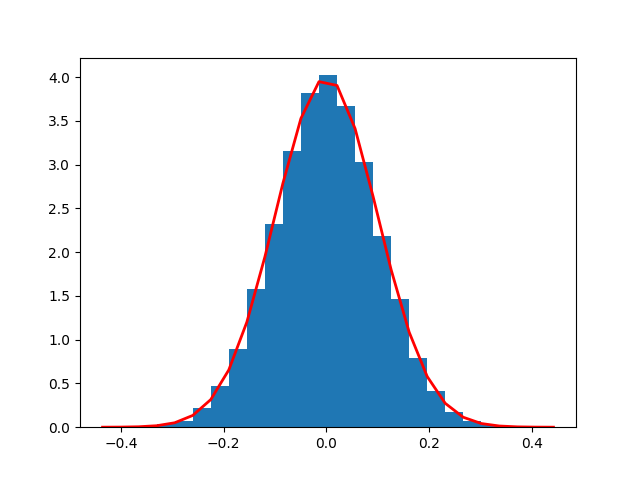

# TSA.practica.01

[TOC]


### Variables aleatorias

$$
X\sim \mathcal{N}(\mu,\sigma) \rightarrow f_X(x)=\frac{1}{\sqrt{2\pi}\sigma}e^{\frac{(x-\mu)^2}{2\sigma^2}}
$$


$$
f(t) = \frac{\Gamma(\frac{\nu+1}{2})}{\sqrt{\nu\pi}\ \Gamma(\frac{\nu}{2})}\left(1+\frac{t^2}{\nu}\right)^{-\frac{\nu+1}{2}}\\
\\

f(t)=\frac{1}{\sqrt{\nu\pi}\mathrm{B}(\frac{1}{2},\frac{\nu}{2})}\left(1+\frac{t^2}{\nu}\right)^{-\frac{\nu+1}{2}}
$$


```python
import numpy as np

# random values data series
X = np.random.normal(mu, sigma, N)
Y = np.random.standard_t(degFreedom, N)
```


### Gráficos

```python
import matplotlib.pyplot as plt

# Plots
plt.plot(X)
plt.show()

count, bins, ignored = plt.hist(X, bins, density=True)
plt.plot(bins, 1/(sigma*np.sqrt(2*np.pi))*np.exp(-(bins-mu)**2/(2*sigma**2)), linewidth=2, color='r')
plt.show()
```




### Series de datos

```python
## data series
fig, (ax1, ax2) = plt.subplots(2)
fig.subtitle('X vs. Y timeseries')
ax1.plot(X)
ax2.plot(Y)
plt.show()
```


### Histogramas

```python
## histograms
fig, (ax1, ax2) = plt.subplots(2)
fig.subtitle('X vs. Y histograms')
ax1.hist(X,bins=30)
ax2.hist(Y,bins=20)
plt.show()
```


### Datos descriptivos

```python
## stats
df.X.describe
df.Y.describe()
dt = pd.DataFrame(df.X.describe())
dt=pd.concat([df.X.describe(), df.Y.describe()],axis=1)
```


| Stat  | X          | Y          |
| ----- | ---------- | ---------- |
| count | 100000     | 100000     |
| mean  | 6.733E-05  | 6.608E-03  |
| std   | 1.001E-01  | 1.129E+00  |
| min   | -3.980E-01 | -8.216E+00 |
| 25%   | -6.742E-02 | -6.949E-01 |
| 50%   | -3.210E-05 | 4.958E-03  |
| 75%   | 6.800E-02  | 7.056E-01  |
| max   | 4.761E-01  | 9.797E+00  |
|       |            |            |


### Series de tiempo

```python
# adding datetime index
time = pd.date_range('2021-10-08', periods=N, freq='s')
df.insert(col,"Datetime", time, True)
df.set_index('Datetime')
df.set_index('Datetime').plot()
plt.show()
```


### Script

```python
import pandas as pd
import matplotlib.pyplot as plt
import numpy as np

# Parameters
N = 100000
mu, sigma = 0, 0.1
bins = 25
degFreedom = 9
col=0

# random values data series
X = np.random.normal(mu, sigma, N)

plt.plot(X)
plt.show()

count, bins, ignored = plt.hist(X, bins, density=True)
plt.plot(bins, 1/(sigma*np.sqrt(2*np.pi))*np.exp(-(bins-mu)**2/(2*sigma**2)), linewidth=2, color='r')
plt.show()

# random values with t-student distribution series
Y = np.random.standard_t(degFreedom, N)
plt.plot(Y)
plt.show()

plt.hist(Y,bins=bins)
plt.show()


# using Dataframe structure
df=pd.DataFrame({'X':X,'Y':Y})
df.plot()
plt.show()

# comparing timeseries
## timeseries
fig, (ax1, ax2) = plt.subplots(2)
fig.subtitle('X vs. Y timeseries')
ax1.plot(X)
ax2.plot(Y)
plt.show()
## histograms
fig, (ax1, ax2) = plt.subplots(2)
fig.subtitle('X vs. Y timeseries')
ax1.hist(X,bins=30)
ax2.hist(Y,bins=20)
plt.show()
## stats
df.X.describe
df.Y.describe()
dt = pd.DataFrame(df.X.describe())
dt=pd.concat([df.X.describe(), df.Y.describe()],axis=1)

# adding datetime index
time = pd.date_range('2021-10-08', periods=N, freq='s')
df.insert(col,"Datetime", time, True)
df.set_index('Datetime')
df.set_index('Datetime').plot()
plt.show()

# dataframe to csv
df.to_csv('../Datasets/randomValues.csv')


```

